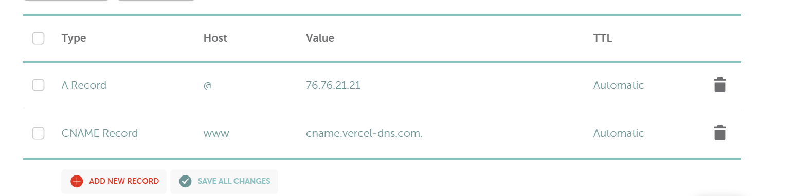

## Table of contents

Think of it as the phone book of the internet. Instead of looking up people's names to find their phone numbers, DNS lets us look up a website name (like google.com) to find its address on the internet, known as an **IP address**.

When you host a website like mdpabel.com on a platform such as Vercel, It uses to store and serve your website's content. Here’s a breakdown of what this typically involves:

1. **DNS Servers**: These are the servers responsible for translating your domain name (mdpabel.com) into an IP address that computers and other devices can understand. For a site hosted on Vercel, you would have set DNS records pointing to Vercel’s servers.

2. **Web Servers**: These are the servers where your actual website files (HTML, CSS, JavaScript, images, etc.) are stored and served from. When someone types mdpabel.com into their browser, the DNS servers direct them to the web servers that hold your site’s content.

Here’s a simple DNS structured:

```
                        [Root]
                          |
            +-------------+-------------+
            |                           |
          [.com]                      [.org]
            |                           |
      +-----+-----+                  [wikipedia.org]
      |           |                      |
  [google.com] [apple.com]       +-------+-------+
      |                          |               |
 +----+----+            [fr.wikipedia.org] [en.wikipedia.org]
 |         |
[www]    [mail]
```

## Zone Delegation

This is like giving someone control over a part of your phone book. For example, the organization that controls .org lets the Wikimedia Foundation manage everything under wikipedia.org.

A DNS zone delegation is the delegation of the authority over a portion of a DNS namespace to a set of different nameservers.

1. **Root**: This is the top of the DNS tree, indicated by a dot (.). It directs where to go next to find the website's address.
2. **Top-Level Domains (TLDs)**: These are categories like .com and .org in our tree. They help organize the internet by types of websites.
3. **Second-Level Domains**: These are specific names under a TLD, like google.com under .com.
4. **Subdomains**: These are further divisions of domains, like www and mail under google.com.

When you want to visit a website like "google.com", your device asks DNS servers for its IP address. It starts at the root, then moves to ".com", and finally to "google.com" servers, getting the IP address each time. This process helps your device find the correct server to connect to.

**if the root zone stopped delegating .com, most of the internet would stop working.**
The root zone is managed by the Internet Cooperation for Assigned Names and Numbers, or ICANN for short. Even though it is managed by a single organization, its DNS servers are hosted by 12 different organizations. We have 13 DNS servers, and there's a simple reason why. Adding a 14th server wouldn't work because it couldn't fit into one standard DNS data packet (UDP).

## Zone Transfer

DNS uses a system where one primary server leads and secondary servers follow. They all have the same data to ensure everyone looking up a website gets the right address.
All servers should reply with the same DNS data. These servers can be kept in sync through a process called zone transfer.

Storing the same data on secondary servers alongside the primary server is crucial for several reasons, which ensure reliability, efficiency, and continuity in serving DNS data. Here’s why it’s important:

1. **Redundancy and Fault Tolerance**: If the primary server experiences downtime due to maintenance, hardware failure, or network issues, secondary servers can continue to serve DNS requests without interruption.

2. **Load Balancing**: Having multiple servers handle DNS requests helps distribute the load. During times of high traffic, this distribution prevents any single server from becoming overwhelmed, which can degrade performance or lead to outages.

3. **Geographic Distribution**: Secondary servers are often located in different geographic locations. This means that DNS queries can be responded to more quickly if a server is closer to the user, reducing latency and speeding up the overall response time for resolving domain names.

4. **Disaster Recovery**: In the event of a catastrophic failure at the primary server location, secondary servers can act as a fail-safe, ensuring that DNS services can be quickly restored without loss of data.

## Authoritative DNS servers

Every DNS zone must have at least two name servers that serve its DNS records. These are the servers that store DNS records for domain names.

Imagine the internet as a vast network of interconnected neighborhoods, with each neighborhood representing a domain (like ".com", ".org", ".uk", etc.). Now, each of these neighborhoods has its own community manager, responsible for keeping track of who lives where. These community managers are the authoritative DNS servers.

When you host a website with a hosting provider like SiteGround, they provide you with their authoritative DNS servers, which in this case are ns1.siteground.net and ns2.siteground.net.

By connecting your domain to these authoritative DNS servers through your domain registrar's settings, you're essentially telling the internet, "Hey, if anyone asks where to find my website, go ask ns1.siteground.net and ns2.siteground.net. They're the experts who know where everything about my website is stored."

So, when someone types in your domain name (e.g., www.yourdomain.com), their browser reaches out to these authoritative DNS servers to get the information it needs to locate your website. These authoritative DNS servers then provide the necessary information, like the IP address where your website is hosted, allowing the browser to load your site.

## Recursive queries:

Authoritative DNS servers are the servers that store DNS records for domain names. But applications like browsers don't query authoritative DNS directly. There are quite a few paths DNS queries can travels before
they return the requested DNS records.

## Common DNS Record Types

### A Record (Address Record):

Maps a domain directly to an IP address. Best for primary domain mappings.

**IN:** The class of the DNS record (Internet).

```bash
example.com.    IN    A    192.0.2.1
```



### CNAME Record (Canonical Name Record):

Maps a domain to another domain, which then resolves to an IP address. Best for subdomains and making DNS management simpler.

When you set up a CNAME record for www.nextgenwordpress.com to point to cname.vercel-dns.com, here's what happens:

1. **User Types the URL:** Someone types www.nextgenwordpress.com in their browser.
2. **DNS Lookup:** The browser asks DNS servers to find the IP address for www.nextgenwordpress.com.
3. **CNAME Record:** The DNS server finds that www.nextgenwordpress.com is an alias for cname.vercel-dns.com.
4. **Resolve CNAME:** The DNS server then looks up the IP address for cname.vercel-dns.com.
5. **Return IP Address:** The DNS server returns the IP address to the browser.
6. **Browser Connects:** The browser connects to the Vercel server using this IP address.
7. **Serve Content:** Vercel serves the website content for www.nextgenwordpress.com.

To the user, it looks like they are accessing www.nextgenwordpress.com, but the content is actually being delivered from Vercel’s servers. The URL in the browser stays www.nextgenwordpress.com.

```bash
www.example.com.    IN    CNAME    example.com.
```

## DNS Record Terms

### @ in DNS Records:

In DNS records, the symbol @ is a placeholder that refers to the root domain (e.g., example.com). Instead of typing the full domain name in each record, @ is used as a shorthand for the base domain. For example, if your domain is 3zerodigital.com, an SPF record for @ applies to the entire domain, meaning any emails sent from anything@3zerodigital.com will be validated against the SPF record.

## Priority in MX Records

The priority in MX (Mail Exchanger) records determines which mail server should be used first when handling incoming mail. A lower number means higher priority. If you have multiple mail servers, the server with the lowest priority number will be used first.

For instance:

- MX Record: secure245.inmotionhosting.com
- Priority: 10

In this case, the mail server secure245.inmotionhosting.com has a priority of 10, meaning it will be tried first for handling incoming mail. If you had another server with priority 20, it would act as a fallback.

## Email

### SPF:

SPF prevents spammers from sending emails on behalf of your domain. The value for SPF will often include the IP addresses or mail servers that are authorized to send email on behalf of your domain.

### DKIM:

DKIM allows the recipient’s email server to verify that the email wasn’t tampered with during transmission. This is a long cryptographic string provided by your email server for email authentication.

### CNAME:

CNAME records are used to map one domain name to another, commonly for mail subdomains like mail.example.com.

### MX

MX records are responsible for directing incoming email to your domain’s email server. This points to the email server that will handle incoming emails for your domain, such as mail.secure245.inmotionhosting.com.

### MX Record

The MX record directs incoming mail to the appropriate mail server. Here’s how to set it up:

```bash
Host: @
Type: MX
Value: secure245.inmotionhosting.com
Priority: 10
```

This record tells the DNS to route incoming emails for 3zerodigital.com to the server secure245.inmotionhosting.com.

### CNAME Record

A CNAME record allows you to map one domain name to another. In the context of email, it is commonly used to point subdomains like mail.example.com to the correct mail server.

```bash
Host: mail
Type: CNAME
Value: secure245.inmotionhosting.com
```

This CNAME record ensures that when someone tries to access mail.3zerodigital.com, they are directed to secure245.inmotionhosting.com, your email server.

### DKIM Record

DKIM allows you to attach a cryptographic signature to your emails, which the receiving server can use to verify the email’s authenticity. Here's an example:

```bash
Host: default._domainkey
Type: TXT
Value: (A long DKIM string provided by your email server)
```

This ensures that emails sent from your domain are signed with a DKIM key, preventing tampering during transmission.

### SPF Record

An SPF record defines which mail servers are authorized to send emails for your domain. Here’s how to set one up:

```bash
Host: @
Type: TXT
value: v=spf1 +ip4:198.46.81.29 +include:smtp.servconfig.com +include:secure245.inmotionhosting.com ~all
```

The value in this SPF record authorizes the IP address 198.46.81.29 and the mail servers at smtp.servconfig.com and secure245.inmotionhosting.com to send emails on behalf of your domain.

**The easiest way to find the correct SPF, DKIM records is through the Email Deliverability tool in cPanel.**

**and to find the correct Go to Email Accounts and select Connect Devices or Set Up Mail Client to view mail server details.**

```bash
Incoming Mail Server: secure245.inmotionhosting.com
Outgoing Mail Server: secure245.inmotionhosting.com
```
