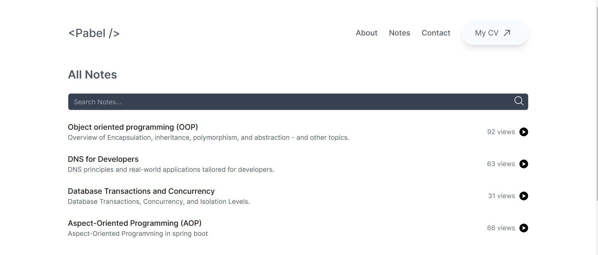

# My Portfolio Notes

Welcome to my portfolio notes repository! This repository serves as the content management system (CMS) for my markdown notes, which are displayed on my portfolio website powered by Next.js.

## Overview

This project utilizes GitHub to store and manage markdown files containing my notes. By leveraging GitHub's **webhook** functionality, the content on my portfolio notes page is automatically updated whenever a new note is pushed to this repository. This seamless integration ensures that my portfolio always reflects the latest additions to my notes collection.

## Viewing Notes

Visit [https://www.mdpabel.com/notes](https://www.mdpabel.com/notes) to browse through my collection of notes. Each note is displayed on its own page, providing easy navigation and readability.

<div style="text-align: center;">
    
</div>

## Schema:

```mdx
---
title: Object oriented programming (OOP)
description: Overview of Encapsulation, inheritance, polymorphism, and abstraction - and other topics.
date: 03-28-2024
isPublished: published
priority: 1000
---
```
